# Как переехать с Senler

Основные понятия, используемые в Senler и Salebot:&#x20;

1. группы подписчиков = списки;
2. триггер = блок с первостепенной проверкой условия;
3. метки = метки, переменные, теги;
4. подписная страница = сайт/минилендинг
5. блок = шаг

## Раздел рассылки

### Автосообщение

(автоматическое сообщение после оформления подписки)\
настраивается в разделе “Воронки”:

1\. создаёте блок с сообщением (вписываете текст приветственной рассылки в поле “ответ”

2\. Выбираете тип блока “первостепенная проверка условия”:

<figure>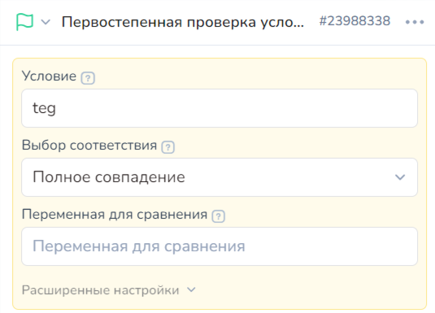<figcaption></figcaption></figure>

3\. в появившихся полях "Условие" впишите название тега в поле “условие” (на примере выше указан Teg);

4\. Если вам нужно, чтобы пользователь получил это сообщение только один раз, и не получал его снова при повторном переходе с этой же подписной страницы (минилендинга), то включите флажок “отвечать один раз за диалог” в расширенных настройках блока:

<figure>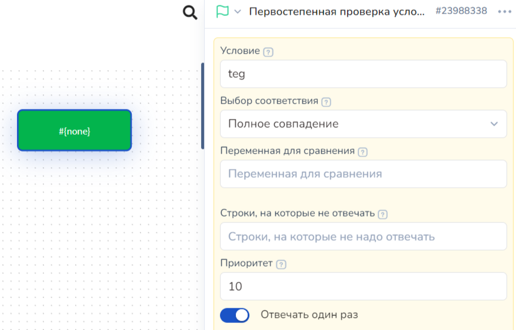<figcaption></figcaption></figure>

5\. нажмите готово.\
\
Если вы сделали всё верно, на белом поле экрана появится ярко-зеленый блок.

<figure>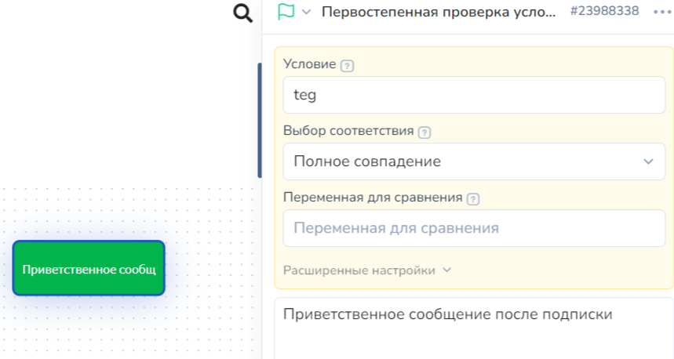<figcaption></figcaption></figure>

6\. Создаём минилендинг с тегом, который указали в условии этого блока.


&#x20;Помните, что теги пишутся только на латинице


Тег прописывается в настройках сайта:

<figure>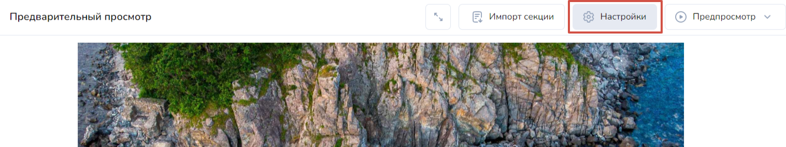<figcaption></figcaption></figure>

<figure>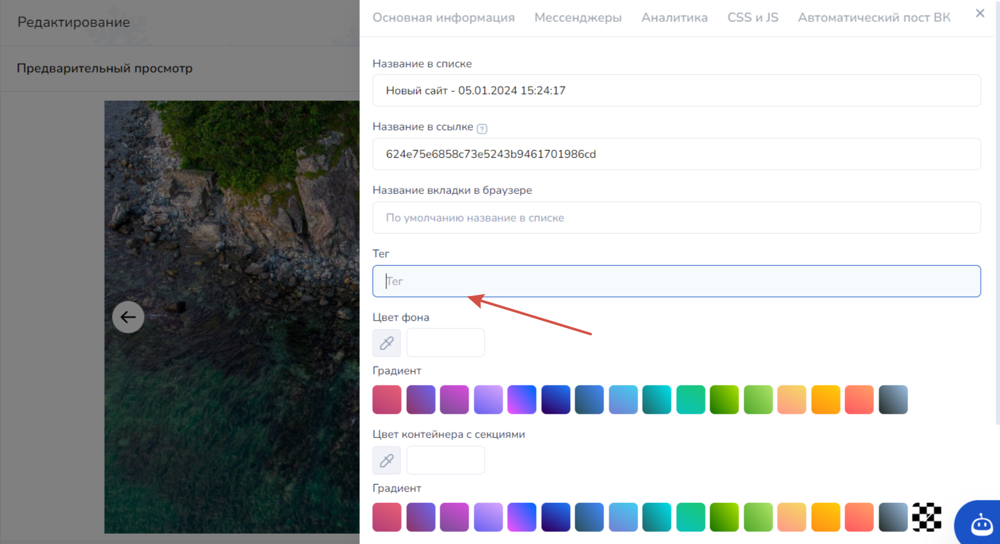<figcaption></figcaption></figure>

### Целевая и Разовая рассылки

Рассылка по загруженному списку получателей, а также по выбранным с помощью фильтров получателям настраиваются из раздела “Рассылки”

<figure>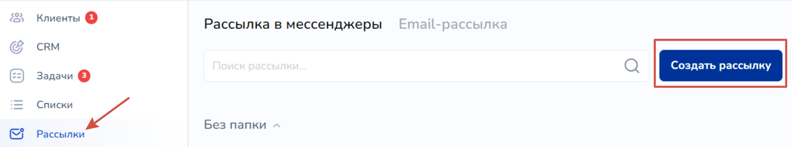<figcaption></figcaption></figure>

Выбрать получателей можно с помощью списков, которые прогружаются в систему Salebot, а также с помощью уже находящихся клиентов в боте (в состоянии воронки).&#x20;

Найдите поле "Рассылка по клиентам из блоков":

<figure>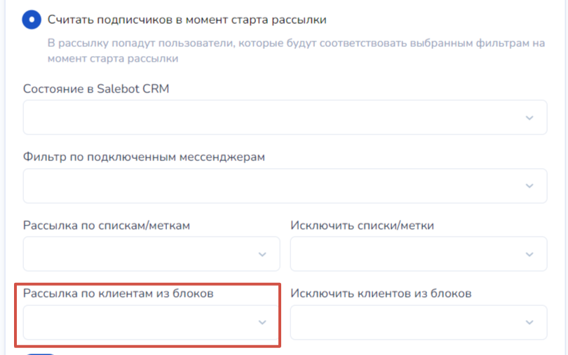<figcaption>
Рис. 7
</figcaption></figure>

Введите название блока - он подсветится в списке всех созданных блоков; либо его номер, который отображается в схеме блоков:

<figure>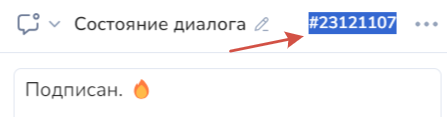<figcaption>
Номер блока для рассылки
</figcaption></figure>

Вы можете выбрать любое необходимое количество блоков, чтобы осуществить рассылку для клиентов, поставив рядом с нужным чекбокс (галочку):

<figure>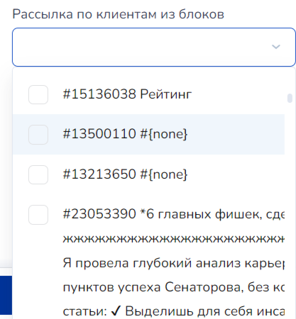<figcaption></figcaption></figure>

Еще один вариант работы с рассылками - **создание рассылки “из блока”**\
(в Senler этот функционал реализуется через фильтры в разделе подписчики и действие - добавить на нужный шаг в боте)\
\
У нас наоборот, в разделе “воронки” вы находите нужный блок, нажимаете на него, справа вверху возле типа блока находите иконку дополнительных настроек и нажимаете “создать рассылку”. Далее вам открывается привычное окно создания рассылки (фильтруете получателей и ставите нужные данные для отправки пользователей в выбранный блок).

<figure>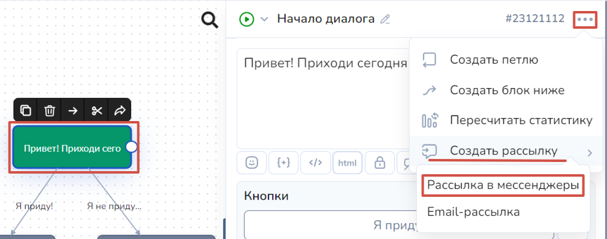<figcaption>
Рис. 4
</figcaption></figure>

## Раздел группы подписчиков

Функционал этого раздела на Salebot реализуется с помощью “минилендингов” и “списков”.\
Полная инструкция по работе со списками

{% embed url="https://www.youtube.com/watch?v=KdcdYffzgs0&feature=emb_imp_woyt&ab_channel=%D0%9A%D0%BE%D0%BD%D1%81%D1%82%D1%80%D1%83%D0%BA%D1%82%D0%BE%D1%80Salebot" %}

## Раздел подписчики

В Salebot вы видите список всех пользователей (подписчиков) в разделе “клиенты”.\
Кроме того, там же находится диалоговое окно с ними. В сенлере этого функционала нет - переписку вы видите только в самой группе вконтакте.\
В сейлботе вы можете общаться с пользователями прямо не выходя за пределы платформы.\
\
Это также удобно, когда вы работаете не только со Вконтакте, но и подключаете остальные мессенджеры. Все ваши пользователи находятся в одном месте и вам удобно администрировать весь проект.

<figure>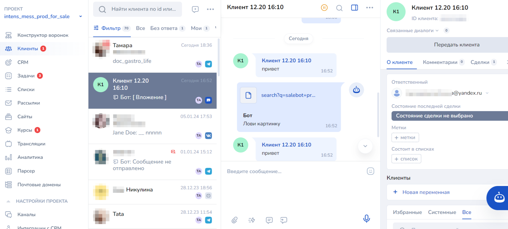<figcaption></figcaption></figure>

Справа находятся фильтры, сверху кнопка “выгрузить” = “экспорт”.

## Как выгрузить базу из Senler

В разделе подписчики поставьте нужный вам фильтр (на скрине пример фильтра по группе подписчиков) или оставьте без фильтра, затем нажмите на кнопку ЭКСПОРТ.

В открывшемся окне выберите CSV и нажмите начать.

.png>)

## Как загрузить подписную базу в Salebot

В разделе “Каналы” нажимаете кнопку подключить “Вконтакте”, подключаете нужную группу.

Внизу видите флажок “синхронизировать переписку из ВК” - если его включить, то сообщения, которые вы будете отправлять из интерфейса вконтакте, будут отображаться и у нас. Если вы параллельно используете и другие рассыльщики то включать его не рекомендуется.


Все, с кем когда либо был диалог в сообщениых группы, загрузятся автоматически.


Если же вы хотите загружать контакты сегментировано, то нажмите “загрузить список клиентов”. Добавьте подготовленный файл с id пользователей, выберите в какой список их поместить (создайте его заранее в разделе “списки”).

<figure>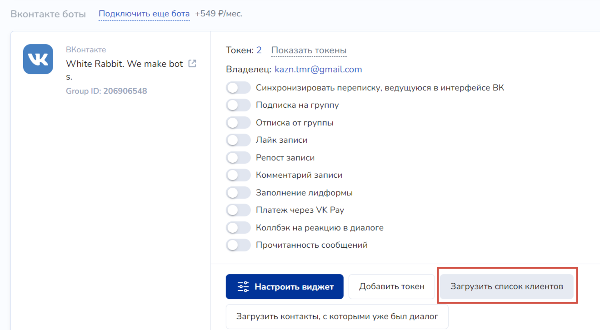<figcaption></figcaption></figure>

Если всё сделано верно, то после кнопки “готово” у вас откроется раздел “клиенты” и вы увидите диалоги с загруженными пользователями.\
Также можно проверить какое количество пользователей находится в указанном при загрузке контактов списке.

## Раздел чат-боты

### Блок - сообщение

Справа у вас по умолчанию находится открытое поле для создания/редактирования блоков. Чтобы создать первый блок схемы, можно кликнуть по белому полю два раза левой кнопкой мыши.

<figure>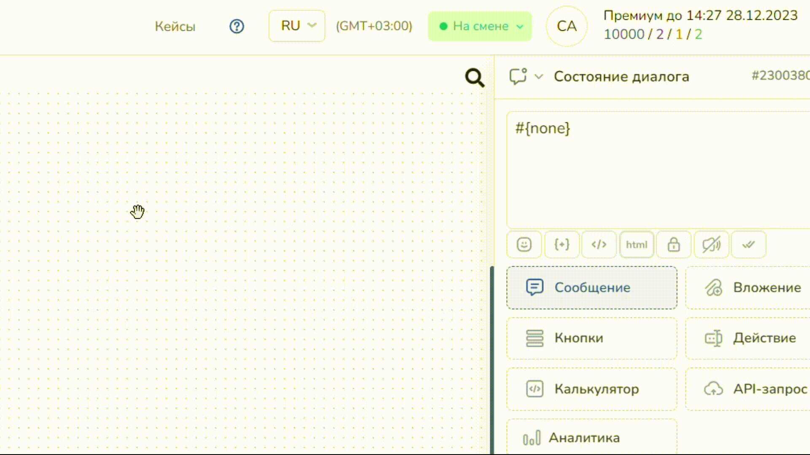<figcaption>
Как создать блок кликом мыши
</figcaption></figure>

Также блок можно создать просто нажав на кнопку сохранить внизу правого поля:

<figure>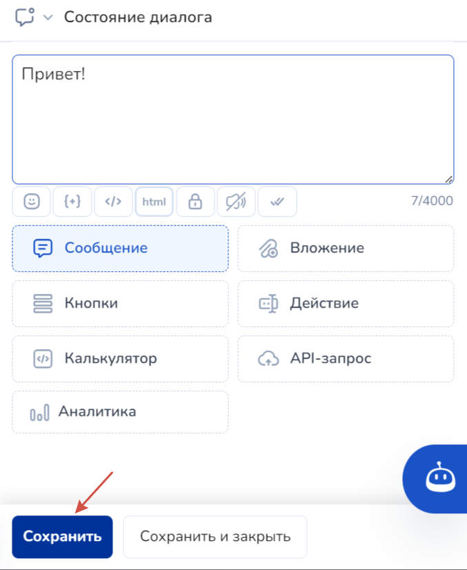<figcaption></figcaption></figure>

Блок с написанным сообщением появится на белом поле.&#x20;

Чтобы создать новый блок с текстом - впишите нужное сообщение в поле c #{none} и нажмите кнопку “сохранить”.

### Настройки вложений в сообщении

Чтобы отправлять сообщения с вложениями, в блок схемы нажмите на "Вложение" и выберите его тип:

<figure>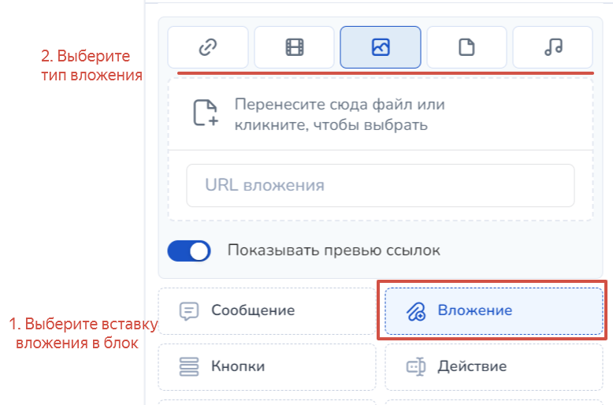<figcaption></figcaption></figure>

Вставить любой тип вложения можно с помощью загрузки файла в блок, а также ссылки в поле URL вложения.&#x20;

<figure>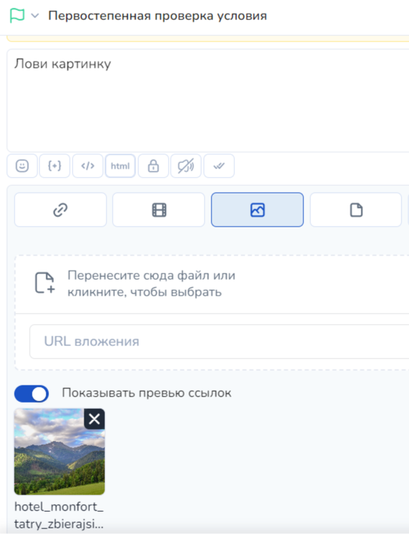<figcaption>
Настройки вложения
</figcaption></figure>

Аналогично вставке изображения, можно отправить в блоке ссылку, видеозапись, файл, а также аудиозапись.&#x20;

### Таймер

Настройка таймеров в Salebot происходит в стрелках.\
Для настройки таймера нужно нажать на шестеренку или правой кнопкой мыши по самой стрелке :

<figure>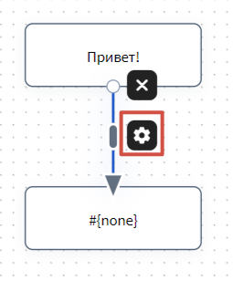<figcaption></figcaption></figure>

Вам откроются поля:

В поле “задержка перед ответом” выставляем таймер-паузу, сколько сек/мин/час/дней бот будет ждать до отправки следующего блока.\
В поле “время отправки” ставим конкретное время в формате ЧЧ:ММ (10:00 например).\
В поле “дата отправки” пишем конкретную дату.\
Также в эти поля можем вставлять переменные, например #{next\_day} - что означает отправка на следующий день.

<figure>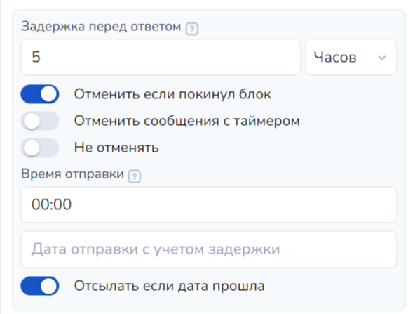<figcaption></figcaption></figure>


Подробная инструкция по работе с датами и временем [здесь](https://docs.salebot.pro/peremennye-1/rabota-s-datami-i-vremenem).  [ ](https://docs.salebot.pro/peremennye-1/rabota-s-datami-i-vremenem)Там же ест[ь пример](https://docs.salebot.pro/peremennye-1/rabota-s-datami-i-vremenem#proverka-popadaniya-v-rabochee-vremya-ili-v-nerabochee) настройки для попадания в рабочее время.&#x20;


### Действия

"Ответ на сообщение" настраивается в стрелках, когда нужно запомнить, что ответил пользователь. Для этого в настройках стрелки нужно включить флажок “пользователь вводит данные” и в поле ниже указать, в какую переменную запишется его ответ.

<figure>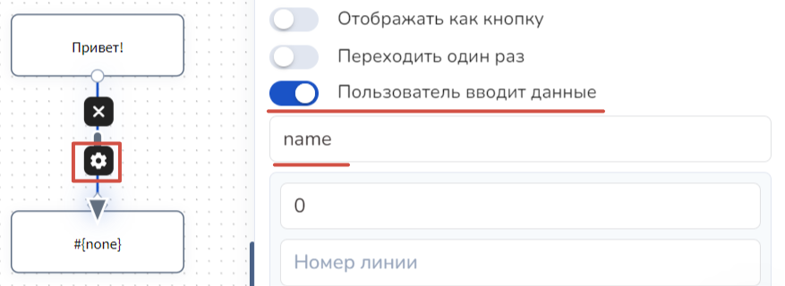<figcaption></figcaption></figure>

Стоит отметить: настройку отправки данных администратору можно осуществить для любого мессенджера.&#x20;


Подробнее об этом читайте в [этой статье.](https://docs.salebot.pro/api-v-konstruktore-salebot.pro/otpravka-zayavok-v-messendzhery)


Действие с группой подписчиков = со списком - доступно при функционале добавить действие в блоке схемы:

<figure><figcaption></figcaption></figure>

Очистить данные (обнулить переменные пользователя) можно с помощью красного блока: необходимо поменять тип блока с “состояние диалога” на “конец сбора данных”.

<figure>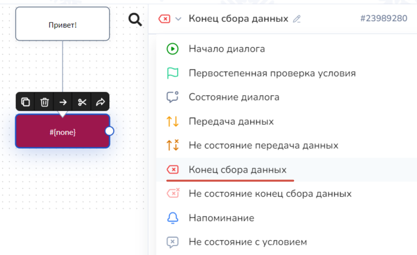<figcaption></figcaption></figure>

## Как работать с кнопками

### Сообщение с кнопками инлайн

Инлайн-кнопки вставляются в настройках блока:\
нажмите на блок с сообщением, в которое нужно добавить кнопки, затем в окне справа нажмите “настройки кнопок” и в поле “расширенные настройки кнопок” вставьте \[{"type": "inline", "text": "название вашей кнопки", "line": 0, "index\_in\_line": 0}]

<figure>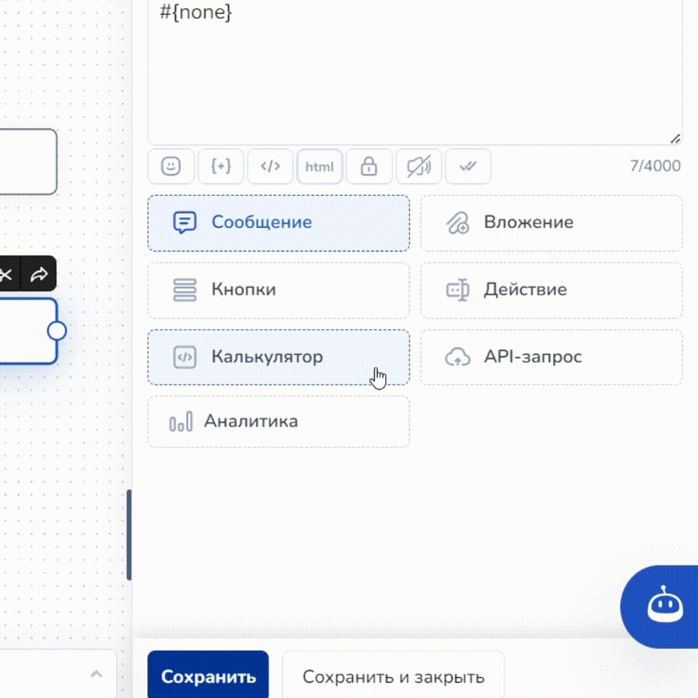<figcaption></figcaption></figure>

На примере выше показано, как добавлять инлайн-кнопки в блоки.

### Сообщение с кнопками в тексте и клавиатурные кнопки

Основное различные кнопок в тексте и клавиатурных кнопок в том, что клавиатурные исчезают после нажатия или ввода текста с клавиатуры, а кнопки в тексте - не пропадают после нажатия.\
В Salebot добавить кнопку с любой необходимой функцией можно в блоке, а также обозначить любое необходимое название. Для этого в блоке схемы выберите "Кнопки" и нажмите "Добавить кнопку":

<figure>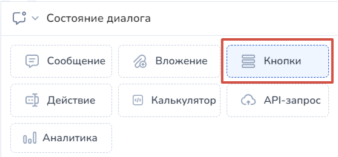<figcaption>
1) Добавляем функцию кнопки в блоке
</figcaption></figure> <figure><figcaption>
2) Добавляем саму кнопку
</figcaption></figure>

Далее откроется окно с настройками кнопки, где можно выбрать ее функцию, а также прописать название и выбрать любой понравившийся цвет:

<figure><figcaption></figcaption></figure>

Далее при необходимости перехода клиента после нажатия кнопки в следующий блок, можно прописать условие с названием кнопки в стрелке:

<figure>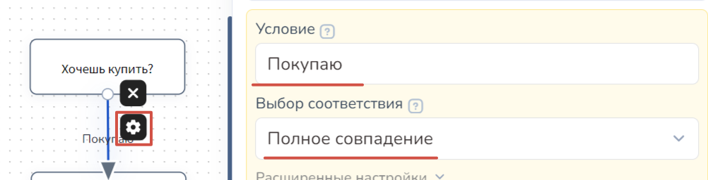<figcaption></figcaption></figure>

## Как настроить напоминания в воронке

\
Для напоминаний мы воспользуемся серыми блоками “не состояние”

<figure>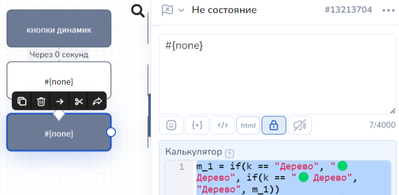<figcaption></figcaption></figure>

Этот блок отправит пользователю сообщение, но при этом не передвинет его никуда из основной воронки.&#x20;

Также в стрелках используем таймер + ВКЛЮЧАЕМ флажок “отменить, если покинул блок”.&#x20;

<figure>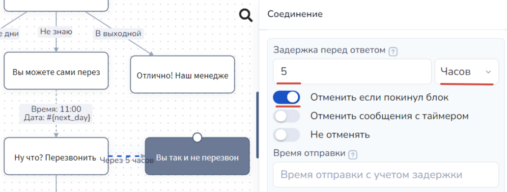<figcaption></figcaption></figure>

Это означает, что эта стрелка сработает только для тех пользователей, которые через указанное время всё еще стоят в блоке и не продвинулись дальше по основной воронке.

Сам блок выглядит следующим образом:

<figure>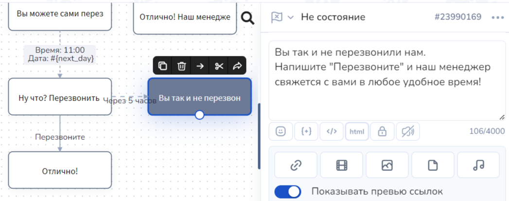<figcaption></figcaption></figure>

Таким образом, через пять часов мы направили клиенту сообщение-напоминание и продвинули его дальше по воронке.&#x20;
